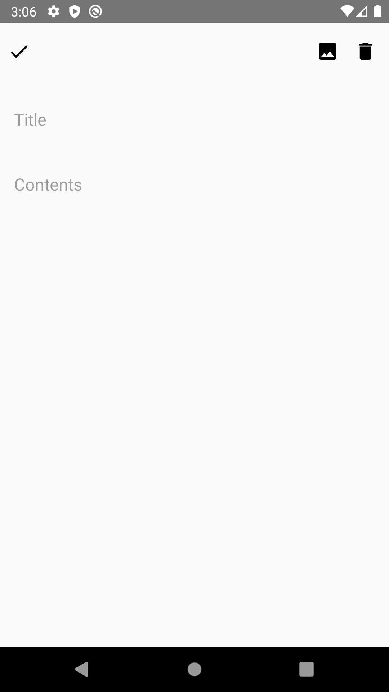
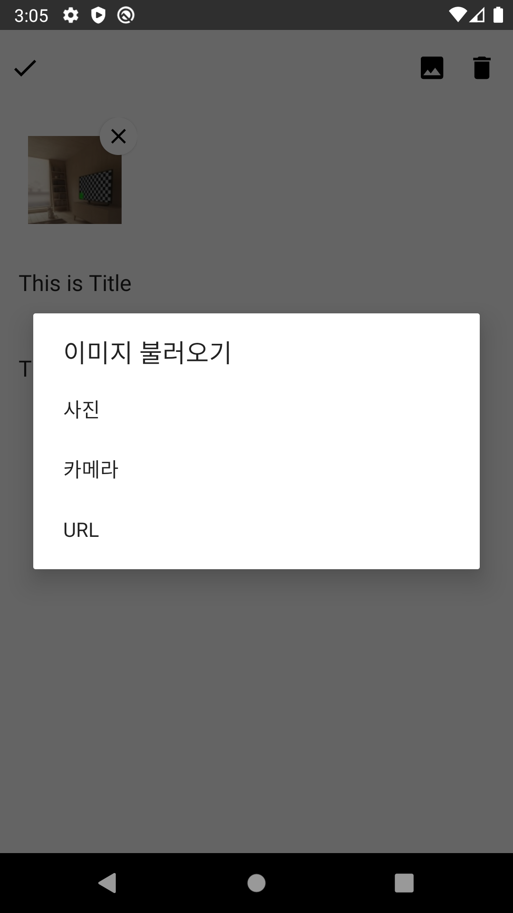
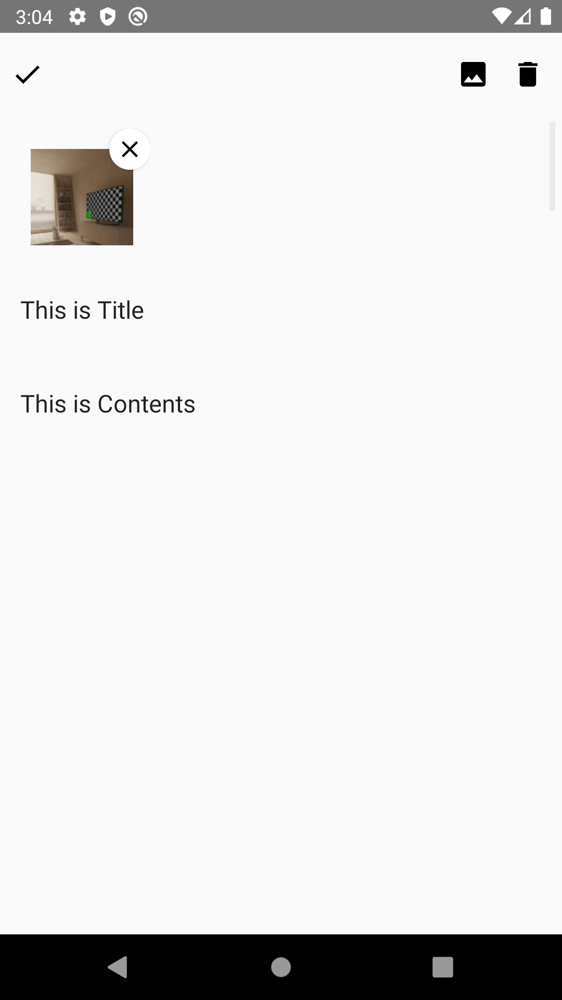
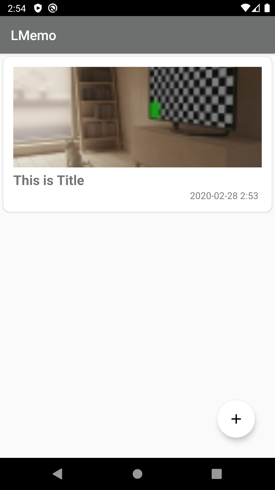

# LMemo
- 글과 그림을 저장할 수 있는 안드로이드 메모장 프로그램

## 기능
1. 사용자가 만든 메모를 모아볼 수 있음.
    - 이미지가 첨부된 경우라면 썸네일을 통해 확인 가능
    - 메모에 이미지가 여러개 첨부된 경우라면 첫 번째 이미지만 썸네일에 표시

2. 메모 리스트 중 하나를 클릭하면 메모 상세 페이지를 확인할 수 있음
    - 메모 상세 페이지에서 메모를 수정 및 삭제 가능
    - 이미지 추가 및 삭제 가능

3. 이미지는 첨부 시 여러 개 첨부 가능하도록 만듦
    - 이미지 첨부 방법은 내부 저장소, 카메라, URL을 통해 저장할 수 있도록 만듦

4. 첨부된 이미지 클릭 시 전체 화면으로 보여주기
    - 전체 화면 이미지에서 줌인/줌아웃 가능

## 구현
- 구현 언어 : kotlin
- 사용 패턴 : MVVM
- 라이브러리
    - Glide : 이미지 로딩
    - Room  : 안드로이드 내부 DB 저장
    - koin : 의존성 주입

## 완성 예시

